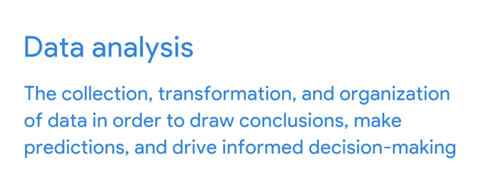

# Đánh Giá Kỹ Năng Phân Tích Dữ Liệu Hiện Tại
## Kiến thức và kỹ năng phân tích dữ liệu

Chuyên viên phân tích dữ liệu cần có:

* Hiểu biết toàn diện về **quy trình phân tích dữ liệu**.
* Kỹ năng kỹ thuật để hoàn thành quy trình phân tích.

### Tự đánh giá kiến thức về quy trình phân tích dữ liệu

Bạn có thể đánh dấu ✔️ nếu các câu sau đúng với bạn:

* Tôi hiểu rõ **quyết định dựa trên dữ liệu (data-driven decision-making)** và cách nó giúp tổ chức xây dựng chiến lược dựa trên thực tế.
* Tôi có thể **đặt câu hỏi và giả thuyết** về các vấn đề kinh doanh để hướng dẫn quá trình phân tích dữ liệu.
* Tôi biết các bước **xác minh độ tin cậy và xác thực dữ liệu**.
* Tôi hiểu **mô hình hóa dữ liệu** và cách tổ chức sử dụng nó để hiểu dữ liệu.
* Tôi có thể chọn và thiết kế **các biểu đồ, hình ảnh hóa** để truyền tải hiệu quả kết quả phân tích tới các bên liên quan.

Nếu bạn đồng ý với các câu trên, bạn đã nắm được những kiến thức cơ bản về quy trình phân tích dữ liệu.

### Tự đánh giá kỹ năng kỹ thuật

Các công cụ thường dùng trong phân tích dữ liệu gồm: **spreadsheets, SQL, Tableau, R**. Bạn hãy tự hỏi mình:

* Tôi có thể **kết hợp dữ liệu từ nhiều nguồn** để phân tích.
* Tôi có thể **sắp xếp dữ liệu** trong cả bảng tính và cơ sở dữ liệu.
* Tôi biết cách **làm sạch dữ liệu**: loại bỏ dữ liệu trùng lặp, sai sót, định dạng đúng.
* Tôi biết cách tạo **biểu đồ, hình ảnh hóa dữ liệu** trong spreadsheet, Tableau và R.
* Tôi có thể viết câu lệnh SQL để **chọn nhiều cột trong bảng**.
* Tôi hiểu về các **package trong R** và biết cách cài đặt package phục vụ cho nhiệm vụ cụ thể.

---
### Dữ liệu
Dữ liệu là tập hợp các sự kiện (thông tin) có thể được sử dụng để rút ra kết luận, đưa ra dự đoán và hỗ trợ ra quyết định.

### Phân tích dữ liệu
Phân tích dữ liệu là quá trình thu thập, chuyển đổi và tổ chức dữ liệu nhằm rút ra kết luận, đưa ra dự đoán và thúc đẩy việc ra quyết định dựa trên thông tin.

## Quy trình phân tích dữ liệu (Data Analysis Process)
Sáu bước của quy trình phân tích dữ liệu [Blog](https://github.com/ksgr5566/Google-Data-Analytics/blob/main/1-Foundations:%20Data%2C%20Data%2C%20Everywhere/Week1-Introducing%20Data%20Analytics.md#data-analysis-life-cycle):
- **Đặt câu hỏi** và xác định vấn đề.
- **Chuẩn bị** dữ liệu bằng cách thu thập và lưu trữ thông tin.
- **Xử lý** dữ liệu bằng cách làm sạch và kiểm tra thông tin. Làm sạch dữ liệu là quá trình sửa hoặc loại bỏ dữ liệu sai, bị hỏng, định dạng không đúng, trùng lặp hoặc không đầy đủ trong một bộ dữ liệu.
- **Phân tích** dữ liệu để tìm ra các mẫu, mối quan hệ và xu hướng.
- **Chia sẻ** dữ liệu với đối tượng của bạn.
- **Hành động** dựa trên dữ liệu và sử dụng kết quả phân tích.

> **Quy trình này áp dụng cho mọi dự án phân tích dữ liệu, giúp bạn đi từ vấn đề thực tế đến hành động cụ thể dựa trên dữ liệu.**

### 1. Đặt câu hỏi (**Ask**)
Xác định rõ vấn đề cần giải quyết, đặt ra các câu hỏi trọng tâm. 
**Ví dụ:** "Làm thế nào để tăng tỷ lệ giữ chân nhân viên mới?". Hỏi ý kiến các bên liên quan để hiểu mong muốn và mục tiêu.

### 2. Chuẩn bị dữ liệu (**Prepare**)
Thu thập, xác định nguồn dữ liệu phù hợp, lên kế hoạch thực hiện. 
**Ví dụ:** Thiết kế khảo sát online cho nhân viên mới, xác định dữ liệu cần thu thập (mức độ hài lòng, quy trình tuyển dụng, lương thưởng...).

### 3. Xử lý dữ liệu (**Process**)
Làm sạch, kiểm tra, bảo mật và tổ chức dữ liệu. Đảm bảo dữ liệu đầy đủ, chính xác, tuân thủ đạo đức và bảo mật.
**Ví dụ:** Chỉ một số nhà phân tích được truy cập dữ liệu gốc, tổng hợp dữ liệu để bảo mật thông tin cá nhân.

### 4. Phân tích dữ liệu (**Analyze**)
Khám phá, tìm kiếm các mẫu, xu hướng, mối liên hệ trong dữ liệu để trả lời câu hỏi ban đầu.
**Ví dụ:** Phát hiện nhân viên trải qua quy trình tuyển dụng phức tạp thường rời đi sớm, còn ai được đánh giá minh bạch thì gắn bó lâu hơn.

### 5. Chia sẻ kết quả (**Share**)
Trình bày phát hiện cho các bên liên quan bằng báo cáo, hình ảnh hóa, thảo luận nhóm. Đảm bảo truyền đạt rõ ràng, đúng đối tượng.
**Ví dụ:** Chia sẻ kết quả với quản lý, trình bày trực tiếp, nhờ quản lý truyền đạt lại cho đội nhóm.

### 6. Hành động (**Act**)
Đưa ra khuyến nghị, triển khai giải pháp dựa trên kết quả phân tích. Theo dõi, đánh giá hiệu quả và cải tiến liên tục.
**Ví dụ:** Chuẩn hóa quy trình tuyển dụng, đánh giá nhân viên; khảo sát lại sau 1 năm để so sánh kết quả và điều chỉnh nếu cần.

**Lưu ý:**
- Mỗi bước đều quan trọng, cần thực hiện tuần tự và có sự phối hợp giữa các bên liên quan.
- Đạo đức và bảo mật dữ liệu là yếu tố then chốt trong suốt quá trình.

 

### Phân tích con người (People Analytics)
Phân tích nguồn nhân lực/Phân tích lực lượng lao động. Đây là việc thu thập và phân tích dữ liệu về những người tạo nên lực lượng lao động của công ty nhằm thu được những hiểu biết để cải thiện cách công ty vận hành.

 

---

***Khoa học dữ liệu*** (Data science) - lĩnh vực biến dữ liệu thành hữu ích - là một thuật ngữ bao trùm ba lĩnh vực: ***học máy, thống kê và phân tích***.
Chúng được phân biệt dựa trên số lượng quyết định bạn biết mình muốn đưa ra trước khi bắt đầu.

Nếu bạn muốn đưa ra một vài ***quyết định quan trọng trong điều kiện không chắc chắn, đó là thống kê***.
Điểm mạnh của thống kê là sự chặt chẽ. Họ rất cẩn trọng để bảo vệ người ra quyết định khỏi việc đi đến kết luận sai.

Nếu bạn muốn ***tự động hóa***, tức là đưa ra rất nhiều quyết định trong điều kiện không chắc chắn, đó là học máy và trí tuệ nhân tạo.
Hiệu suất là điểm mạnh của kỹ sư học máy và AI.

Nhưng nếu bạn không biết mình sẽ đưa ra bao nhiêu quyết định trước khi bắt đầu? Nếu bạn tìm kiếm cảm hứng, muốn khám phá những điều chưa biết? Đó là phân tích dữ liệu.

Điểm mạnh của nhà phân tích là tốc độ. Họ có thể lướt qua lượng dữ liệu lớn để khám phá và tìm ra những thông tin giá trị, những tiềm năng đáng để mang đến cho người ra quyết định.

---

 

### Hệ sinh thái dữ liệu
Hệ sinh thái là một nhóm các thành phần tương tác với nhau.

Hệ sinh thái dữ liệu bao gồm nhiều thành phần tương tác với nhau để tạo ra, quản lý, lưu trữ, tổ chức, phân tích và chia sẻ dữ liệu. Các thành phần này bao gồm phần cứng, phần mềm và những người sử dụng chúng.

Ví dụ, bạn có thể truy cập vào cơ sở dữ liệu của cửa hàng bán lẻ, nơi chứa tên khách hàng, địa chỉ, các giao dịch mua trước đó và đánh giá của khách hàng.

 

### Khoa học dữ liệu
Khoa học dữ liệu được định nghĩa là tạo ra những cách thức mới để mô hình hóa và hiểu những điều chưa biết bằng cách sử dụng dữ liệu thô.

Nhà khoa học dữ liệu (**data scientist**) tạo ra các câu hỏi mới dựa trên dữ liệu, trong khi nhà phân tích (**analyst**) tìm câu trả lời cho các câu hỏi hiện có bằng cách tạo ra các hiểu biết từ nguồn dữ liệu.

Data Analysis là một phần nhỏ trong Data Analytics — tức là Data Analytics là chiếc ô bao trùm toàn bộ hệ sinh thái dữ liệu.

 

### Phân tích dữ liệu
Phân tích dữ liệu, nói một cách đơn giản, là khoa học về dữ liệu.

Đây là một khái niệm rất rộng, bao gồm mọi thứ từ công việc quản lý và sử dụng dữ liệu đến các công cụ và phương pháp mà người làm dữ liệu sử dụng hàng ngày.

Dữ liệu, phân tích dữ liệu và hệ sinh thái dữ liệu đều nằm dưới chiếc ô của phân tích dữ liệu.

 

### Ra quyết định dựa trên dữ liệu

***Data-driven decision-making (DDDM)*** là quá trình sử dụng dữ liệu thực tế (facts) để hướng dẫn chiến lược kinh doanh.

Sử dụng các sự thật để định hướng chiến lược kinh doanh.

Bước đầu tiên trong việc ra quyết định dựa trên dữ liệu là xác định nhu cầu kinh doanh.

Dữ liệu đơn thuần sẽ không bao giờ mạnh mẽ bằng dữ liệu kết hợp với kinh nghiệm, quan sát và đôi khi là trực giác của con người. Để tận dụng tối đa việc ra quyết định dựa trên dữ liệu, điều quan trọng là phải có sự đóng góp của những người hiểu rõ vấn đề kinh doanh. Những người này được gọi là **chuyên gia lĩnh vực**, họ có khả năng xem xét kết quả phân tích dữ liệu, nhận diện các điểm chưa hợp lý, làm rõ các vùng mờ và cuối cùng xác nhận các lựa chọn được đưa ra.

 

### Linh cảm (Gut Instinct)
Linh cảm là sự hiểu biết trực giác về một điều gì đó mà không cần hoặc rất ít lời giải thích. Đây không phải lúc nào cũng là ý thức rõ ràng; chúng ta thường nhận ra các tín hiệu mà không hề hay biết. Bạn chỉ đơn giản có "cảm giác" điều đó là đúng.

Kết hợp dữ liệu với kiến thức kinh doanh, cộng thêm một chút linh cảm, sẽ là một phần phổ biến trong quy trình của bạn với tư cách là một nhà phân tích dữ liệu mới. Điều quan trọng là xác định tỷ lệ pha trộn phù hợp cho từng dự án cụ thể. Nhiều khi, điều này sẽ phụ thuộc vào mục tiêu phân tích của bạn.

Trọng tâm của việc ra quyết định dựa trên dữ liệu là dữ liệu, vì vậy các nhà phân tích sẽ hiệu quả nhất khi đảm bảo rằng các sự thật đang dẫn dắt chiến lược.

[Thuật ngữ](https://docs.google.com/document/d/1yd3IZr2VupqaTPyjrlauxDLj4MsDHl9r9J3wmNf11mE/template/preview)

